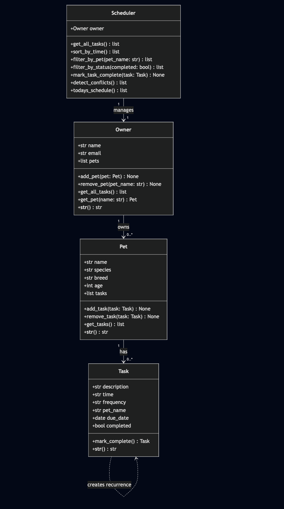

\# PawPal+

A smart pet care management app that helps owners keep their furry friends happy and healthy. PawPal+ tracks daily routines — feedings, walks, medications, and appointments — using algorithmic logic to organize and prioritize tasks.

---

## Demo


---

## System Architecture



---

## Getting Started

### Setup

```bash
python3 -m venv .venv
source .venv/bin/activate
pip install -r requirements.txt
```

### Run the CLI demo
```bash
python3 main.py
```

### Run the Streamlit app
```bash
python3 -m streamlit run app.py
```

---

## Features

- **Owner & Pet Management** — Create an owner profile and add multiple pets with name and species
- **Task Scheduling** — Add tasks with time, duration, priority, frequency, and due date
- **Sorting by Time** — All tasks are automatically sorted chronologically using a lambda key on HH:MM strings
- **Filtering** — Filter tasks by pet name, completion status, or priority level
- **Conflict Warnings** — Scheduler detects when two tasks overlap based on start time + duration and displays a warning
- **Daily Recurrence** — Marking a daily or weekly task complete automatically creates the next occurrence using Python's timedelta
- **Streamlit UI** — Three-tab interface: Add Task, Today's Schedule, Complete a Task

---

## Smarter Scheduling

The Scheduler class adds algorithmic intelligence beyond basic task storage:

- **Time-based sorting** uses Python's sorted() with a lambda key on "HH:MM" strings, with priority weight as a tiebreaker
- **Conflict detection** iterates all task pairs and flags any where a task's start time falls within another task's active window (start + duration)
- **Recurring task automation** uses timedelta(days=1) or timedelta(weeks=1) to schedule the next occurrence when a task is marked complete

---

## Testing PawPal+

### Run tests
```bash
python3 -m pytest
```

### What the tests cover
- Task completion status changes correctly
- One-time tasks return None on completion (no recurrence)
- Daily tasks generate a next-day task on completion
- Weekly tasks generate a next-week task on completion
- Adding a task to a pet increases its task count
- Removing a task decreases the count
- Sort order is strictly chronological
- Pet filter returns only that pet's tasks
- Status and priority filters work correctly
- Conflict detection flags overlapping tasks
- Sequential tasks (no overlap) produce no warnings
- Recurring completion adds a new task to the pet
- Completed tasks are excluded from today's schedule

### Confidence Level
4/5 — Core scheduling behaviors are well covered. Edge cases like midnight-crossing tasks or empty owner states would be next to test.

---

## Project Structure

```
pawpal-plus/
├── pawpal_system.py     # Core logic: Owner, Pet, Task, Scheduler
├── main.py              # CLI demo script
├── app.py               # Streamlit UI
├── tests/
│   └── test_pawpal.py   # Automated pytest suite
├── reflection.md        # Design and AI collaboration reflection
├── requirements.txt
└── README.md
```